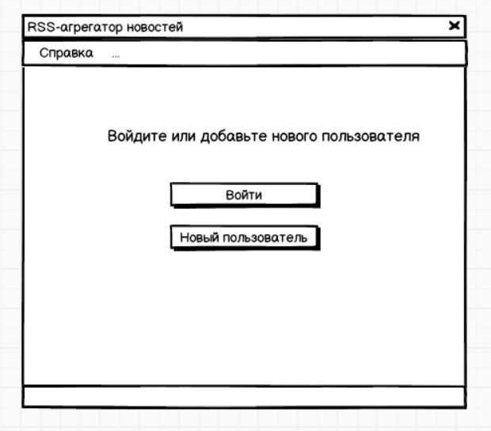
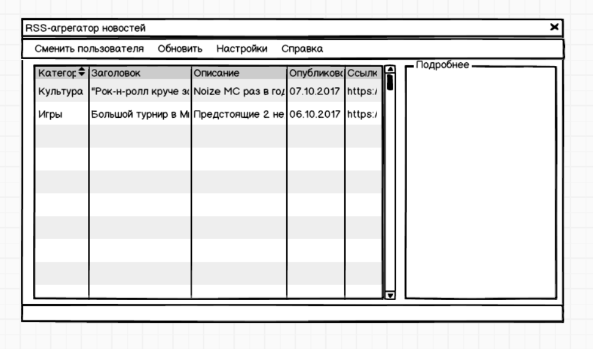
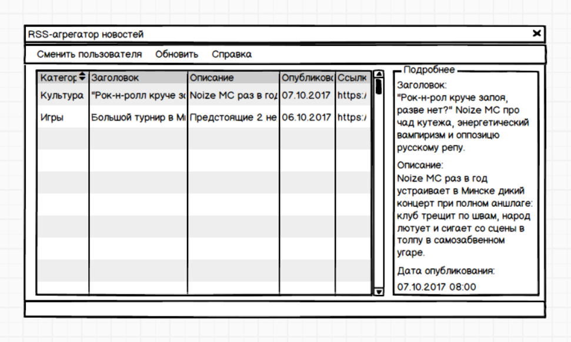

# Требования к проекту
---

# Содержание
1 [Введение](#intro)  
1.1 [Назначение](#appointment)  
1.2 [Бизнес-требования](#business_requirements)  
1.2.1 [Исходные данные](#initial_data)  
1.2.2 [Возможности бизнеса](#business_opportunities)  
1.2.3 [Границы проекта](#project_boundary)  
1.3 [Аналоги](#analogues)  
2 [Требования пользователя](#user_requirements)  
2.1 [Программные интерфейсы](#software_interfaces)  
2.2 [Интерфейс пользователя](#user_interface)  
2.3 [Характеристики пользователей](#user_specifications)  
2.3.1 [Классы пользователей](#user_classes)  
2.3.2 [Аудитория приложения](#application_audience)  
2.3.2.1 [Целевая аудитория](#target_audience)  
2.3.2.1 [Побочная аудитория](#collateral_audience)  
2.4 [Предположения и зависимости](#assumptions_and_dependencies)  
3 [Системные требования](#system_requirements)  
3.1 [Функциональные требования](#functional_requirements)  
3.1.1 [Основные функции](#main_functions)  
3.1.1.1 [Вход пользователя в приложение](#user_logon_to_the_application)  
3.1.1.2 [Настройка профиля активного пользователя](#setting_up_the_profile_of_the_active_user)  
3.1.1.3 [Просмотр краткой информации о каждой из найденных новостей](#view_brief_information_about_each_of_the_news_found)  
3.1.1.4 [Смена активного пользователя](#active_user_change)  
3.1.2 [Ограничения и исключения](#restrictions_and_exclusions)  
3.2 [Нефункциональные требования](#non-functional_requirements)  
3.2.1 [Атрибуты качества](#quality_attributes)  
3.2.1.1 [Требования к удобству использования](#requirements_for_ease_of_use)  
3.2.1.2 [Требования к безопасности](#security_requirements)  
3.2.2 [Внешние интерфейсы](#external_interfaces)  
3.2.3 [Ограничения](#restrictions)  

<a name="intro"/>

# 1 Введение

<a name="appointment"/>

## 1.1 Назначение
В этом документе описаны функциональные и нефункциональные требования к приложению «RSS-агрегатор новостей» для ОС Windows 10. Этот документ предназначен для команды, которая будет реализовывать и проверять корректность работы приложения. 

<a name="business_requirements"/>

## 1.2 Бизнес-требования

<a name="initial_data"/>

### 1.2.1 Исходные данные
Большинство людей старшей возрастной категории получают актуальную информацию посредством просмотра новостных передач по телевидению, прослушивания их по радио, либо чтения газет. Однако, не все категории информации интересуют каждого человека, поэтому получение новостей такими способами сопряжено с потерей времени на выборку только необходимой информации. В связи с этим многие из представителей данной возрастной категории начинают использовать компьютеры для получения актуальных новостей посредством сети Интернет. Большинсво из них не обладает достаточной технической грамотностью для использования приложений, рассчитанных на продвинутых пользователей. Дополнительные трудности возникают из-за того, что эти приложения зачастую не рассчитаны на использование людьми с плохим зрением. Это приводит к тому, что многие возвращаются к привычным способам получения информации.

<a name="business_opportunities"/>

### 1.2.2 Возможности бизнеса
Многие люди старшей возрастной категории желают иметь приложение, которое позволит получать интересные новости, обладая минимальой технической грамотностью. Подобное приложение позволит им тратить меньше времени на поиск необходимой информации. Интерфейс, спроектированный с учётом всех особенностей данной возрастной категории, и дополнение приложения подробной инструкцией позволят увеличить количество людей, использующих данное приложение.

<a name="project_boundary"/>

### 1.2.3 Границы проекта
Приложение «RSS-агрегатор новостей» позволит зарегистрированным пользователям просматривать краткую информацию о новостях, отобранных согласно их предпочтениям. Для анонимных пользователей предусмотрена возможность просмотра информации о новостях, отобранных с [основных интернет-ресурсов](/Documents/A%20list%20of%20Internet%20resources%20that%20are%20available%20to%20anonymous%20users.md).

<a name="analogues"/>

## 1.3 Аналоги
Обзор аналогов представлен в документе [Overview of analogues](/Documents/Overview%20of%20analogues.md).

<a name="user_requirements"/>

# 2 Требования пользователя

<a name="software_interfaces"/>

## 2.1 Программные интерфейсы
Приложение обрабатывает RSS-ленты интернет-ресурсов, соответствующие стандартам RSS 1.0 и 2.0. 

<a name="user_interface"/>

## 2.2 Интерфейс пользователя
Окно входа в приложение.  
  
Главное окно приложения (пользователь зарегестрирован).  
  
Главное окно приложения после выбора новости в таблице (пользователь зарегестрирован).  
  
Главное окно приложения после выбора новости в таблице (анонимный пользователь).  
  
Окно настройки профиля пользователя.  

<a name="user_specifications"/>

## 2.3 Характеристики пользователей

<a name="user_classes"/>

### 2.3.1 Классы пользователей

| Класс пользователей | Описание |
|:---|:---|
| Анонимные пользователи | Пользователи, которые не хотят регистрироваться в приложении. Имеют доступ к частичному функционалу |
| Зарегистрированные пользователи | Пользователи, которые вошли в приложение под своим именем (псевдонимом), желающие просматривать краткую информацию о новостях, отобранных согласно их предпочтениям. Имеют доступ к полному функционалу |

<a name="application_audience"/>

### 2.3.2 Аудитория приложения

<a name="target_audience"/>

#### 2.3.2.1 Целевая аудитория
Люди старшей возрастной категории со средним или выше среднего уровнем образования, обладающие минимальной технической грамотностью.

<a name="collateral_audience"/>

#### 2.3.2.2 Побочная аудитория
Люди средней возрастной категории, обладающие вышеперечисленными качествами.

<a name="assumptions_and_dependencies"/>

## 2.4 Предположения и зависимости
1. Приложение не работает при отсутствии подключения к Интернету;
2. Приложение не обрабатывает данные RSS-лент, недоступных в момент запроса.

<a name="system_requirements"/>

# 3 Системные требования

<a name="functional_requirements"/>

## 3.1 Функциональные требования

<a name="main_functions"/>

### 3.1.1 Основные функции

<a name="user_logon_to_the_application"/>

#### 3.1.1.1 Вход пользователя в приложение
**Описание.** Пользователь имеет возможность использовать приложение без создания собственного профиля либо войдя в свою учётную запись.

| Функция | Требования | 
|:---|:---|
| Вход в приложение анонимного пользователя | Приложение должно предоставить пользователю возможность просматривать новости, отобранные с основных интернет-ресурсов, без возможности изменения списка интернет-ресурсов и списков ключевых фраз |
| Добавление нового пользователя | Приложение должно запросить у пользователя ввести имя и, после успешного завершения операции, предоставить возможность редактирования последнего. Пользователь должен либо ввести имя (псевдоним), либо отменить действие |
| *Пользователь с таким именем существует* | *Приложение должно известить пользователя об ошибке регистрации и запросить ввод псевдонима. Пользователь должен либо ввести псевдоним, либо отменить действие* |
| Вход зарегистрированного пользователя в приложение | Приложение должно предоставить пользователю список имён (псевдонимов) зарегестрированных пользователей. Пользователь должен либо выбрать из списка своё имя (псевдоним), либо отменить действие |

<a name="setting_up_the_profile_of_the_active_user"/>

#### 3.1.1.2 Настройка профиля активного пользователя
**Описание.** Пользователь имеет возможность редактировать список ссылок на интернет-ресурсы, с которых производится выборка новостей, и списки (включений и исключений) ключевых фраз для фильтрации новостей.
 
| Функция | Требования | 
|:---|:---|
| Добавление интернет-ресурсов | Приложение должно предоставить пользователю поле для ввода адреса RSS-ленты интернет-ресурса. Пользователь должен либо ввести адрес и подвердить действие, либо отменить его |
| Удаление интернет-ресурсов | Пользователь имеет возможножность выделить адрес RSS-ленты в списке интернет-ресурсов и удалить его |
| Добавление ключевых фраз | Приложение должно предоставить пользователю возможность выбрать список, в который будет добавлена фраза, и поле для её ввода. После выбора списка пользователь должен либо ввести фразу и подвердить действие, либо отменить его |
| Удаление ключевых фраз | Пользователь имеет возможность выделить ключевую фразу в любом из списков и удалить её |

<a name="view_brief_information_about_each_of_the_news_found"/>

#### 3.1.1.3 Просмотр краткой информации о каждой из найденных новостей
**Описание.** Пользователь имеет возможность просмотреть краткую информацию о каждой новости, представленной в таблице.

**Требование.** При выборе новости в таблице, её заголовок, описание и дата размещения отображаются в области "Подробнее" главного окна приложения.

<a name="active_user_change"/>

#### 3.1.1.4 Смена активного пользователя
**Описание.** Приложение должно предоставлять возможность сменить активного пользователя без перезапуска приложения.

**Требование.** Приложение выходит из профиля актвного пользователя и возвращается к окну входа в приложение.

<a name="restrictions_and_exclusions"/>

### 3.1.2 Ограничения и исключения
1. Приложение работает только при наличии подключения к Интернету;
2. Отслеживание новостей интернет-ресурса осуществляется при наличии у последнего RSS-ленты. 

<a name="non-functional_requirements"/>

## 3.2 Нефункциональные требования

<a name="quality_attributes"/>

### 3.2.1 Атрибуты качества

<a name="requirements_for_ease_of_use"/>

#### 3.2.1.1 Требования к удобству использования
1. Доступ к основным функциям приложения не более чем за две операции;
2. Все функциональные элементы пользовательского интерфейса имеют названия, описывающие действие, которое произойдет при выборе элемента;
3. Пошаговая инструкция использования основных функций приложения отображена в справке.

<a name="security_requirements"/>

#### 3.2.1.2 Требования к безопасности
Приложение предоставляет возможность просмотра и редактирования профиля только активного пользователя.

<a name="external_interfaces"/>

### 3.2.2 Внешние интерфейсы
Окна приложения удобны для использования пользователями с плохим зрением:
  * размер шрифта не менее 14пт;
  * функциональные элементы контрастны фону окна.

<a name="restrictions"/>

### 3.2.3 Ограничения
1. Приложение реализовано на платформе .NET Framework 4.6;
2. Язык реализации приложения: С#.
